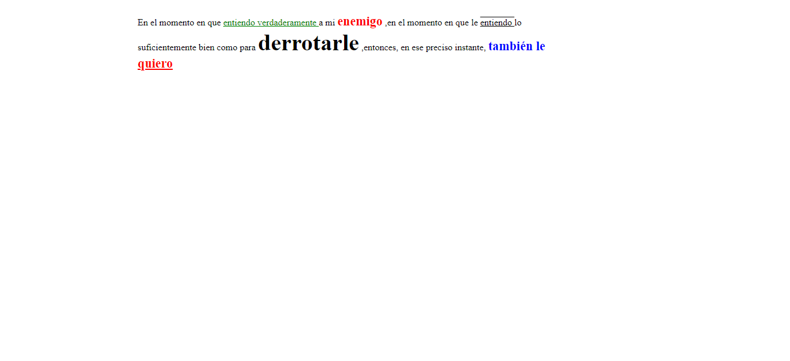
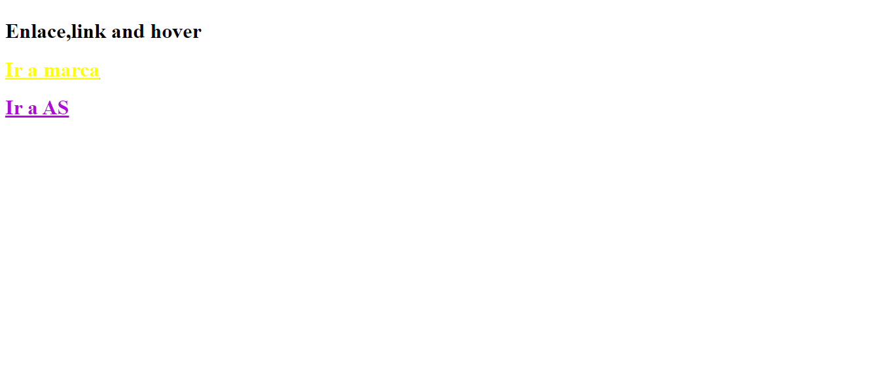
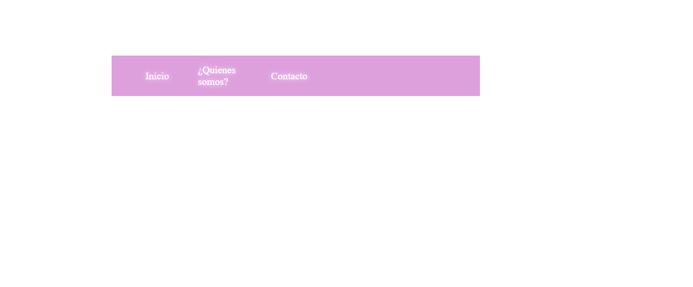
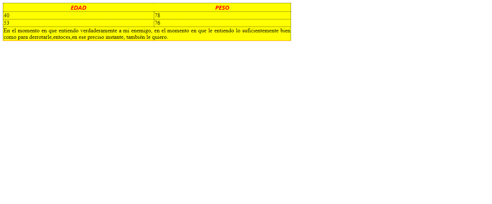

<h1> Taller Full Stack Basico Unidad# 9</h1>
<h1> Yener Jose Cassiani Julio</h1>
<h2>Información</h2>

Curso: Full Starck Basico - Grupo 1

Profesor:Cristian Patiño

<h2> Punto 1: Link de Figma</h2>
<a href ="https://www.figma.com/file/7Cx8VwOWd0axpmLWhKhc2N/Yener-Jose-Cassiani-%2FWireFrames?type=design&node-id=0%3A1&t=hDrot2Bc5Kwd7P7C-1">Link de Figma</a>
 
<a href ="https://samiyeiyene23.github.io/talle-9-full-stack/">
Link de Pagina</a>

<h2>Punto 2: HTML</h2>

<h2>Punto 3: CSS</h2>

<h2>Punto 4: CSS</h2>

<h2>Punto 5: CSS</h2>

<h2>Punto 6: CSS</h2>

<h2>Punto 7-8: CSS</h2>

<h2>Punto 9: CSS</h2>

